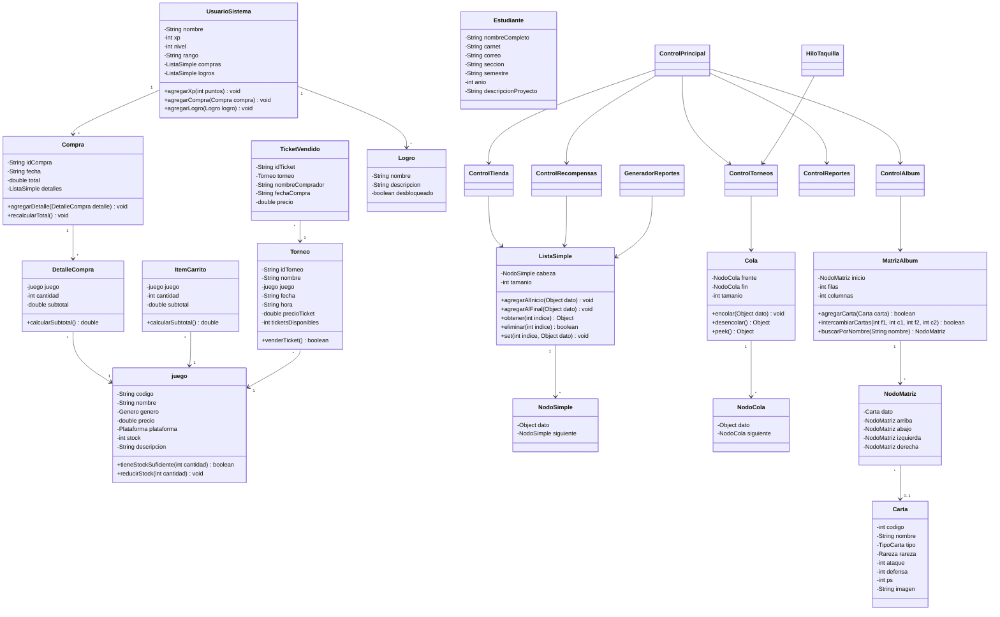

# GameZone Pro

## Diagrama de clases

```mermaid
classDiagram

class juego {
  -String codigo
  -String nombre
  -Genero genero
  -double precio
  -Plataforma plataforma
  -int stock
  -String descripcion
  +tieneStockSuficiente(int cantidad) boolean
  +reducirStock(int cantidad) void
}

class Carta {
  -int codigo
  -String nombre
  -TipoCarta tipo
  -Rareza rareza
  -int ataque
  -int defensa
  -int ps
  -String imagen
}

class Compra {
  -String idCompra
  -String fecha
  -double total
  -ListaSimple detalles
  +agregarDetalle(DetalleCompra detalle) void
  +recalcularTotal() void
}

class DetalleCompra {
  -juego juego
  -int cantidad
  -double subtotal
  +calcularSubtotal() double
}

class ItemCarrito {
  -juego juego
  -int cantidad
  -double subtotal
  +calcularSubtotal() double
}

class Torneo {
  -String idTorneo
  -String nombre
  -juego juego
  -String fecha
  -String hora
  -double precioTicket
  -int ticketsDisponibles
  +venderTicket() boolean
}

class TicketVendido {
  -String idTicket
  -Torneo torneo
  -String nombreComprador
  -String fechaCompra
  -double precio
}

class UsuarioSistema {
  -String nombre
  -int xp
  -int nivel
  -String rango
  -ListaSimple compras
  -ListaSimple logros
  +agregarXp(int puntos) void
  +agregarCompra(Compra compra) void
  +agregarLogro(Logro logro) void
}

class Logro {
  -String nombre
  -String descripcion
  -boolean desbloqueado
}

class Estudiante {
  -String nombreCompleto
  -String carnet
  -String correo
  -String seccion
  -String semestre
  -int anio
  -String descripcionProyecto
}

class ListaSimple {
  -NodoSimple cabeza
  -int tamanio
  +agregarAlInicio(Object dato) void
  +agregarAlFinal(Object dato) void
  +obtener(int indice) Object
  +eliminar(int indice) boolean
  +set(int indice, Object dato) void
}

class NodoSimple {
  -Object dato
  -NodoSimple siguiente
}

class Cola {
  -NodoCola frente
  -NodoCola fin
  -int tamanio
  +encolar(Object dato) void
  +desencolar() Object
  +peek() Object
}

class NodoCola {
  -Object dato
  -NodoCola siguiente
}

class MatrizAlbum {
  -NodoMatriz inicio
  -int filas
  -int columnas
  +agregarCarta(Carta carta) boolean
  +intercambiarCartas(int f1, int c1, int f2, int c2) boolean
  +buscarPorNombre(String nombre) NodoMatriz
}

class NodoMatriz {
  -Carta dato
  -NodoMatriz arriba
  -NodoMatriz abajo
  -NodoMatriz izquierda
  -NodoMatriz derecha
}

class ControlPrincipal
class ControlTienda
class ControlAlbum
class ControlTorneos
class ControlRecompensas
class ControlReportes
class HiloTaquilla
class GeneradorReportes

Compra "1" --> "*" DetalleCompra
DetalleCompra "*" --> "1" juego
ItemCarrito "*" --> "1" juego
TicketVendido "*" --> "1" Torneo
Torneo "*" --> "1" juego
UsuarioSistema "1" --> "*" Compra
UsuarioSistema "1" --> "*" Logro

ListaSimple "1" --> "*" NodoSimple
Cola "1" --> "*" NodoCola
MatrizAlbum "1" --> "*" NodoMatriz
NodoMatriz "*" --> "0..1" Carta

ControlPrincipal --> ControlTienda
ControlPrincipal --> ControlAlbum
ControlPrincipal --> ControlTorneos
ControlPrincipal --> ControlRecompensas
ControlPrincipal --> ControlReportes

ControlTienda --> ListaSimple
ControlAlbum --> MatrizAlbum
ControlTorneos --> Cola
ControlRecompensas --> ListaSimple
HiloTaquilla --> ControlTorneos
GeneradorReportes --> ListaSimple
```
